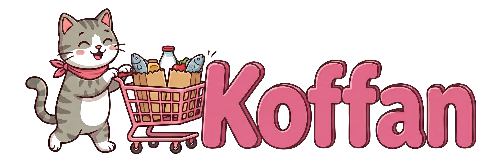
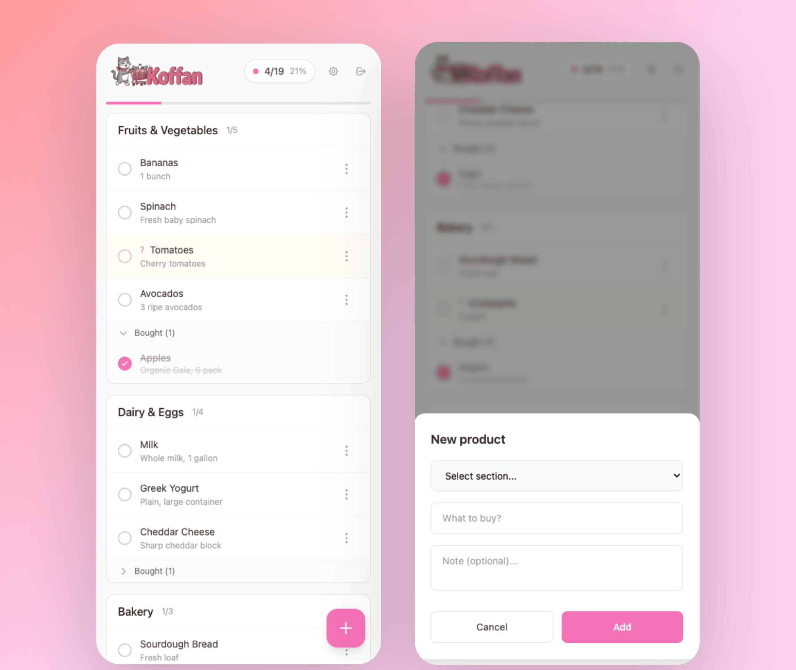

<p align="center">
  
</p>

<h1 align="center">Koffan</h1>

<p align="center">
  <strong>Open source shopping assistant</strong><br>
  A fast and simple app for managing your shopping list together<br><br>
  Self-hosted app for your own server. Easiest way to deploy is with <a href="https://github.com/coollabsio/coolify">Coolify</a>.
</p>

---

## Screenshots

<p align="center">
  
</p>

---

## What is Koffan?

Koffan is a lightweight web application for managing shopping lists, designed for couples and families. It allows real-time synchronization between multiple devices, so everyone knows what to buy and what's already in the cart.

The app works in any browser on both mobile and desktop. Just one password to log in - no complicated registration required.

## Why did I build this?

I needed an app that would let me and my wife create a shopping list together and do grocery shopping quickly and efficiently. I tested various solutions, but none of them were simple and fast enough.

I built the first version in **Next.js**, but it turned out to be very resource-heavy. I have a lot of other things running on my server, so I decided to optimize. I rewrote the app in **Go** and now it uses only **~2.5 MB RAM** instead of hundreds of megabytes!

## Features

- **Ultra-lightweight** - ~16 MB on disk, ~2.5 MB RAM
- **PWA** - Install on your phone like a native app
- **Offline mode** - Add, edit, check/uncheck products without internet (auto-sync when back online)
- Organize products into sections (e.g., Dairy, Vegetables, Cleaning)
- Mark products as purchased
- Mark products as "uncertain" (can't find it in the store)
- Real-time synchronization (WebSocket)
- Responsive interface (mobile-first)
- Multi-language support (PL, EN, DE, ES, FR, PT)
- Simple login system
- Rate limiting protection against brute-force attacks

## Tech Stack

- **Backend:** Go 1.21 + Fiber
- **Frontend:** HTMX + Alpine.js + Tailwind CSS
- **Database:** SQLite

## Local Setup (without Docker)

You can run Koffan directly on your machine using Go. This works on any system (macOS, Linux, Windows).

### 1. Install Go

**macOS (Homebrew):**
```bash
brew install go
```

**Linux (Debian/Ubuntu):**
```bash
sudo apt install golang-go
```

**Windows:**
Download from [go.dev/dl](https://go.dev/dl/)

### 2. Clone and Run

```bash
git clone https://github.com/PanSalut/Koffan.git
cd Koffan
go run main.go
```

App available at http://localhost:3000

Default password: `shopping123`

To set a custom password:
```bash
APP_PASSWORD=yourpassword go run main.go
```

## Docker

```bash
docker-compose up -d
# App available at http://localhost:80
```

## Environment Variables

| Variable | Default | Description |
|----------|---------|-------------|
| `APP_ENV` | `development` | Set to `production` for secure cookies |
| `APP_PASSWORD` | `shopping123` | Login password |
| `PORT` | `80` (Docker) / `3000` (local) | Server port |
| `DB_PATH` | `./shopping.db` | Database file path |
| `DEFAULT_LANG` | `en` | Default UI language (pl, en, de, es, fr, pt) |
| `LOGIN_MAX_ATTEMPTS` | `5` | Max login attempts before lockout |
| `LOGIN_WINDOW_MINUTES` | `15` | Time window for counting attempts |
| `LOGIN_LOCKOUT_MINUTES` | `30` | Lockout duration after exceeding limit |

## Deploy to Your Server

### Docker

```bash
git clone https://github.com/PanSalut/Koffan.git
cd Koffan
docker build -t koffan .
docker run -d -p 80:80 -e APP_PASSWORD=your-password -v koffan-data:/data koffan
```

### Coolify

1. Add new resource → **Docker Compose** → Select your Git repository or use `https://github.com/PanSalut/Koffan`
2. Set domain in **Domains** section
3. Enable **Connect to Predefined Network** in Advanced settings
4. Add environment variable `APP_PASSWORD` with your password
5. Deploy

### Persistent Storage

Data is stored in `/data/shopping.db`. The volume ensures your data persists across deployments.

## Feature Requests

Have an idea? Check [open feature requests](https://github.com/PanSalut/Koffan/issues?q=is%3Aissue+is%3Aopen+label%3Aenhancement) and vote with 👍 on the ones you want most.

Want to suggest something new? [Create an issue](https://github.com/PanSalut/Koffan/issues/new).

## Support

If you find this project useful, consider supporting its development:

[](https://github.com/sponsors/PanSalut)

## License

MIT
